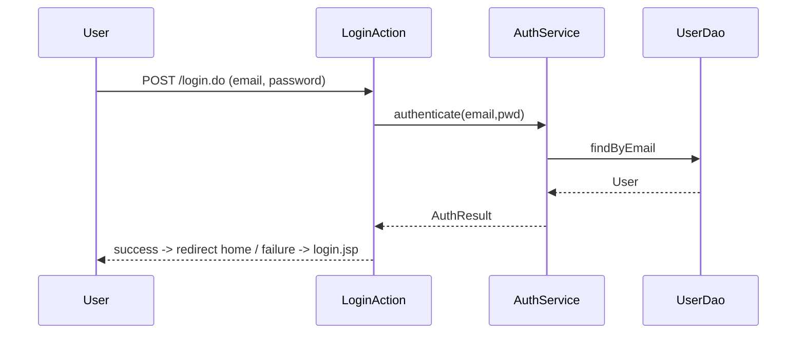
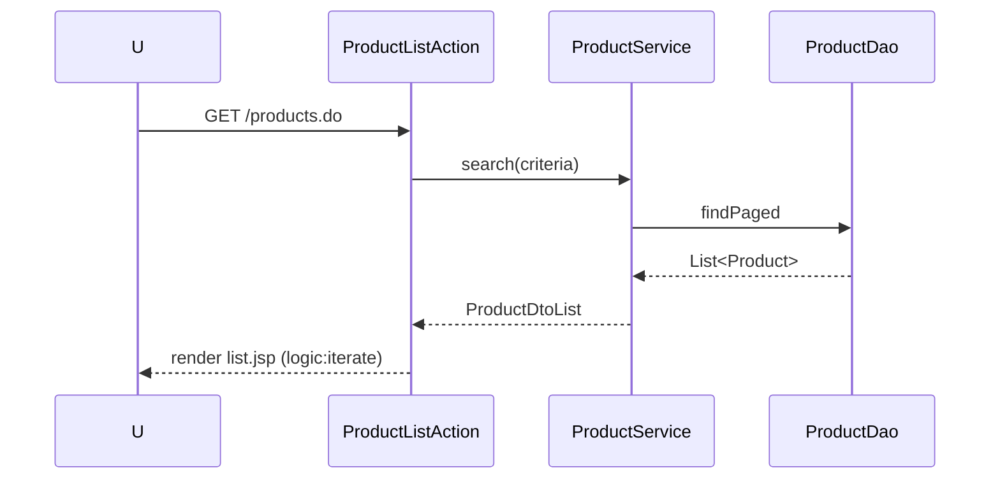
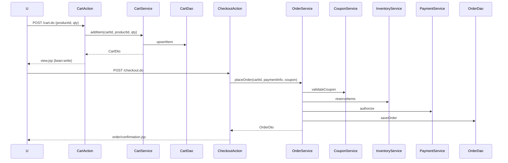
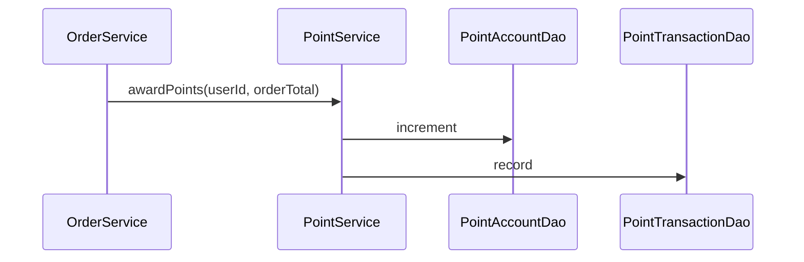

# Monolithic Struts Detailed Design Document (Java 1.5 / JSP / Struts 1.2.9)

<!-- markdownlint-disable MD013 -->

## 1. Overview

- Implements a ski shop EC site **monolithically** (consolidating microservices into a single WAR).
- Technical constraints: **Java 1.5**, **JSP**, **Struts 1.2.9**, Struts tag libraries (`html`, `bean`, `logic`, `tiles`).
- Design approach: **Layered Architecture** + **Orthodox GoF/EE Patterns**
  - Front Controller (Struts ActionServlet)
  - Command (Action), ActionForm
  - MVC (JSP=View, Action=Controller, Service/Domain=Model)
  - Service Facade / Business Delegate / Service Locator
  - DAO + DTO/ValueObject
  - Template Method (DAO commonization)
  - Intercepting Filter / RequestProcessor (authentication/authorization check)
  - Singleton (service locator, factory)

## 2. Requirements and Constraints

- **Language specification**: Java 1.5 (generics optional, no annotations, no lambdas, no Streams)
- **UI**: JSP + Struts tags (`<html:form>`, `<html:text>`, `<bean:write>`, `<logic:iterate>`)
- **Controller**: Struts 1.2.9 (XML-based configuration)
- **DI**: Manual (ServiceLocator / Factory)
- **Persistence**: JDBC + DAO (Commons DBCP, Commons DbUtils allowed)
- **View composition**: Tiles 1.x (optional) or JSP include
- **Build**: Maven 2 or Ant (recommended: Maven 2, maven-compiler-plugin 1.5)
- **Application server**: Tomcat 6.x / Java 5 compatible container
- **Logging**: log4j 1.2
- **Testing**: JUnit 4.12 (Java5 compatible) or JUnit 3.8 + StrutsTestCase
- **Email sending**: JavaMail 1.4.x (SMTP)

## 3. Technology Stack

| Category | Technology | Version | Purpose |
| ---- | ---- | ---------- | ---- |
| Language | Java | 1.5 | Application implementation |
| Web FW | Struts | 1.2.9 | MVC, Front Controller |
| View | JSP | 2.0 | Template |
| Taglib | struts-html/bean/logic/tiles | 1.2.x | View manipulation |
| JDBC | commons-dbcp | 1.2.x | Connection pool |
| JDBC helper | commons-dbutils | 1.1 | Query helper (optional) |
| Logging | log4j | 1.2.17 | Logging |
| Email | JavaMail | 1.4.7 | Notification email |
| Testing | JUnit | 3.8/4.x | Unit testing |
| Build | Maven | 2.2.x | Dependency management |

## 4. Layered Architecture

```text
Presentation (JSP/Tiles + Struts Taglib)
   ↑ Action (Controller) - org.apache.struts.action.Action
   ↑ Form (ActionForm) - Input validation (Commons Validator)
   ↑ Service Facade / Business Delegate
   ↑ Domain/DTO (POJO, JavaBean)
   ↑ DAO (JDBC) + Template Method
   ↑ Infrastructure (DBCP, Transaction management, ServiceLocator)
```

### Design Pattern Application

- **Front Controller**: `ActionServlet` + `RequestProcessor`
- **Command**: Processing per `Action` class
- **Service Facade**: `*Service` provides use case-level API
- **Facade**: `OrderFacade` aggregates composite use cases like order processing
- **Business Delegate**: Mediates between Action → Service (reduces coupling)
- **DAO**: Encapsulates DB access, SQL management
- **DTO/VO**: Display data objects passed to JSP
- **Template Method**: Common processing in `AbstractDao` (connection/exception/close)
- **Intercepting Filter**: Authentication/authorization check (`AuthRequestProcessor`)

## 5. Module Structure (Microservice Integration)

| Original Service | Monolith Module/Package Example |
| ------------ | ------------------------------- |
| frontend-service | `com.skishop.web` (Actions/JSP), `com.skishop.service.catalog` |
| authentication-service | `com.skishop.service.auth`, `com.skishop.domain.user` |
| coupon-service | `com.skishop.service.coupon` |
| inventory-management-service | `com.skishop.service.inventory` |
| payment-cart-service | `com.skishop.service.cart`, `com.skishop.service.payment` |
| point-service | `com.skishop.service.point` |
| sales-management-service | `com.skishop.service.order` |
| user-management-service | `com.skishop.service.user` |

### Package Example

```text
com.skishop.common
  ├─ util
  ├─ dao (AbstractDao, DaoException)
  ├─ service (ServiceLocator)
  ├─ validation
com.skishop.domain
  ├─ user (User, Role, UserSession)
  ├─ product (Product, Category, Price, Inventory)
  ├─ coupon (Coupon, Campaign)
  ├─ cart (Cart, CartItem)
  ├─ order (Order, OrderItem, Shipment, Return)
  ├─ point (PointAccount, PointTransaction)
  ├─ address (Address)
com.skishop.dto
  ├─ user (UserDto, LoginResultDto)
  ├─ product (ProductDto, CategoryDto)
  ├─ cart (CartDto, CartItemDto)
  ├─ order (OrderDto, OrderItemDto)
  ├─ coupon (CouponDto)
  ├─ point (PointBalanceDto)
com.skishop.service
  ├─ auth (AuthService)
  ├─ user (UserService)
  ├─ catalog (ProductService, CategoryService)
  ├─ inventory (InventoryService)
  ├─ coupon (CouponService)
  ├─ cart (CartService)
  ├─ payment (PaymentService)
  ├─ order (OrderService)
  ├─ point (PointService)
  ├─ shipping (ShippingService)
  ├─ tax (TaxService)
  ├─ mail (MailService)
com.skishop.dao
  ├─ user (UserDao, RoleDao, UserSessionDao)
  ├─ product (ProductDao, CategoryDao, PriceDao, InventoryDao)
  ├─ coupon (CouponDao, CampaignDao)
  ├─ cart (CartDao, CartItemDao)
  ├─ order (OrderDao, OrderItemDao, ShipmentDao, ReturnDao)
  ├─ point (PointAccountDao, PointTransactionDao)
com.skishop.web
  ├─ action (HomeAction, LoginAction, ProductListAction, ProductDetailAction, CartAction, CheckoutAction, CouponApplyAction, OrderHistoryAction, PointBalanceAction)
  ├─ form (LoginForm, ProductSearchForm, AddCartForm, CheckoutForm, CouponForm)
  ├─ filter / processor (AuthRequestProcessor)
  ├─ tiles (layouts)
```

## 6. Struts Configuration

### web.xml (excerpt)

```xml
<web-app>
  <display-name>SkiShop Monolith</display-name>

  <filter>
    <filter-name>CharacterEncodingFilter</filter-name>
    <filter-class>org.apache.catalina.filters.SetCharacterEncodingFilter</filter-class>
    <init-param>
      <param-name>encoding</param-name><param-value>UTF-8</param-value>
    </init-param>
  </filter>
  <filter-mapping>
    <filter-name>CharacterEncodingFilter</filter-name>
    <url-pattern>/*</url-pattern>
  </filter-mapping>

  <servlet>
    <servlet-name>action</servlet-name>
    <servlet-class>org.apache.struts.action.ActionServlet</servlet-class>
    <init-param>
      <param-name>config</param-name><param-value>/WEB-INF/struts-config.xml</param-value>
      <param-name>debug</param-name><param-value>2</param-value>
      <param-name>detail</param-name><param-value>2</param-value>
    </init-param>
    <load-on-startup>2</load-on-startup>
  </servlet>

  <servlet-mapping>
    <servlet-name>action</servlet-name>
    <url-pattern>*.do</url-pattern>
  </servlet-mapping>

  <welcome-file-list>
    <welcome-file>index.jsp</welcome-file>
  </welcome-file-list>
</web-app>
```

### struts-config.xml (excerpt)

```xml
<struts-config>
  <form-beans>
    <form-bean name="loginForm" type="com.skishop.web.form.LoginForm"/>
    <form-bean name="productSearchForm" type="com.skishop.web.form.ProductSearchForm"/>
    <form-bean name="addCartForm" type="com.skishop.web.form.AddCartForm"/>
    <form-bean name="checkoutForm" type="com.skishop.web.form.CheckoutForm"/>
    <form-bean name="couponForm" type="com.skishop.web.form.CouponForm"/>
    <form-bean name="registerForm" type="com.skishop.web.form.RegisterForm"/>
    <form-bean name="passwordResetRequestForm" type="com.skishop.web.form.PasswordResetRequestForm"/>
    <form-bean name="passwordResetForm" type="com.skishop.web.form.PasswordResetForm"/>
    <form-bean name="addressForm" type="com.skishop.web.form.AddressForm"/>
    <form-bean name="adminProductForm" type="com.skishop.web.form.admin.AdminProductForm"/>
  </form-beans>

  <global-exceptions>
    <exception key="error.global" type="java.lang.Exception" path="/error.jsp"/>
  </global-exceptions>

  <global-forwards>
    <forward name="home" path="/home.do"/>
    <forward name="login" path="/login.do"/>
    <forward name="products" path="/products.do"/>
    <forward name="cart" path="/cart.do"/>
  </global-forwards>

  <controller processorClass="com.skishop.web.processor.AuthRequestProcessor"/>

  <action-mappings>
    <action path="/home" type="com.skishop.web.action.HomeAction" scope="request" validate="false" input="/WEB-INF/jsp/home.jsp"/>
    <action path="/login" type="com.skishop.web.action.LoginAction" name="loginForm" input="/WEB-INF/jsp/auth/login.jsp" scope="request" validate="true">
      <forward name="success" path="/home.do"/>
      <forward name="failure" path="/WEB-INF/jsp/auth/login.jsp"/>
    </action>
    <action path="/register" type="com.skishop.web.action.RegisterAction" name="registerForm" input="/WEB-INF/jsp/auth/register.jsp" scope="request" validate="true">
      <forward name="success" path="/login.do"/>
      <forward name="failure" path="/WEB-INF/jsp/auth/register.jsp"/>
    </action>
    <action path="/password/forgot" type="com.skishop.web.action.PasswordForgotAction" name="passwordResetRequestForm" input="/WEB-INF/jsp/auth/password/forgot.jsp" scope="request" validate="true"/>
    <action path="/password/reset" type="com.skishop.web.action.PasswordResetAction" name="passwordResetForm" input="/WEB-INF/jsp/auth/password/reset.jsp" scope="request" validate="true"/>
    <action path="/products" type="com.skishop.web.action.ProductListAction" name="productSearchForm" input="/WEB-INF/jsp/products/list.jsp" scope="request" validate="false"/>
    <action path="/product" type="com.skishop.web.action.ProductDetailAction" input="/WEB-INF/jsp/products/detail.jsp" scope="request" validate="false">
      <forward name="success" path="/WEB-INF/jsp/products/detail.jsp"/>
      <forward name="notfound" path="/WEB-INF/jsp/products/notfound.jsp"/>
    </action>
    <action path="/cart" type="com.skishop.web.action.CartAction" name="addCartForm" input="/WEB-INF/jsp/cart/view.jsp" scope="session" validate="true"/>
    <action path="/checkout" type="com.skishop.web.action.CheckoutAction" name="checkoutForm" input="/WEB-INF/jsp/cart/checkout.jsp" scope="request" validate="true"/>
    <action path="/coupon/apply" type="com.skishop.web.action.CouponApplyAction" name="couponForm" input="/WEB-INF/jsp/cart/view.jsp" scope="request" validate="true"/>
    <action path="/orders" type="com.skishop.web.action.OrderHistoryAction" scope="request" validate="false" input="/WEB-INF/jsp/orders/history.jsp"/>
    <action path="/orders/cancel" type="com.skishop.web.action.OrderCancelAction" scope="request" validate="true"/>
    <action path="/orders/return" type="com.skishop.web.action.OrderReturnAction" scope="request" validate="true"/>
    <action path="/points" type="com.skishop.web.action.PointBalanceAction" scope="request" validate="false" input="/WEB-INF/jsp/points/balance.jsp"/>
    <action path="/logout" type="com.skishop.web.action.LogoutAction" scope="request" validate="false"/>
    <action path="/addresses" type="com.skishop.web.action.AddressListAction" scope="request" validate="false" input="/WEB-INF/jsp/account/addresses.jsp"/>
    <action path="/addresses/save" type="com.skishop.web.action.AddressSaveAction" name="addressForm" input="/WEB-INF/jsp/account/address_edit.jsp" scope="request" validate="true"/>
    <!-- Admin -->
    <action path="/admin/products" type="com.skishop.web.action.admin.AdminProductListAction" scope="request" validate="false" input="/WEB-INF/jsp/admin/products/list.jsp"/>
    <action path="/admin/product/edit" type="com.skishop.web.action.admin.AdminProductEditAction" name="adminProductForm" input="/WEB-INF/jsp/admin/products/edit.jsp" scope="request" validate="true"/>
    <action path="/admin/orders" type="com.skishop.web.action.admin.AdminOrderListAction" scope="request" validate="false" input="/WEB-INF/jsp/admin/orders/list.jsp"/>
    <action path="/admin/order/update" type="com.skishop.web.action.admin.AdminOrderUpdateAction" scope="request" validate="true"/>
  </action-mappings>

  <message-resources parameter="messages"/>
</struts-config>
```

### Tiles (optional) tiles-defs.xml (excerpt)

```xml
<tiles-definitions>
  <definition name="baseLayout" path="/WEB-INF/jsp/layouts/base.jsp">
    <put name="title" value=""/>
    <put name="header" value="/WEB-INF/jsp/common/header.jsp"/>
    <put name="footer" value="/WEB-INF/jsp/common/footer.jsp"/>
    <put name="body" value=""/>
  </definition>
  <definition name="home" extends="baseLayout">
    <put name="title" value="Home"/>
    <put name="body" value="/WEB-INF/jsp/home.jsp"/>
  </definition>
</tiles-definitions>
```

### validation.xml (excerpt)

```xml
<form-validation>
  <formset>
    <form name="loginForm">
      <field property="email" depends="required,email">
        <arg0 key="label.email"/>
      </field>
      <field property="password" depends="required,minlength">
        <arg0 key="label.password"/>
        <var><var-name>minlength</var-name><var-value>8</var-value></var>
      </field>
    </form>
  </formset>
</form-validation>
```

## 7. Data Model (Main Tables)

### User & Auth

- `users(id UUID PK, email, username, password_hash, status, role, created_at, updated_at)`
- `user_sessions(id UUID PK, user_id FK, session_id, ip_address, user_agent, expires_at, is_active)`
- `roles(id UUID PK, name)`
- `user_roles(id UUID PK, user_id FK, role_id FK)`
- `oauth_accounts(id UUID PK, user_id FK, provider, provider_user_id)`
- `security_logs(id UUID PK, user_id FK, event_type, ip_address, user_agent, details_json)`
- `user_addresses(id UUID PK, user_id FK, label, recipient_name, postal_code, prefecture, address1, address2, phone, is_default, created_at, updated_at)`
- `password_reset_tokens(id UUID PK, user_id FK, token, expires_at, used_at)`

### Catalog / Inventory / Pricing

- `products(id VARCHAR PK, name, brand, description, category_id, sku, status, created_at, updated_at)`
- `categories(id UUID PK, name, parent_id)`
- `prices(id UUID PK, product_id FK, regular_price DECIMAL, sale_price DECIMAL NULL, currency_code, sale_start_date, sale_end_date)`
- `inventory(id UUID PK, product_id FK, quantity INT, reserved_quantity INT, status)`
- `product_images(id UUID PK, product_id FK, url, type, sort_order)`

### Cart / Payment / Orders

- `carts(id UUID PK, user_id FK NULL, session_id NULL, status, expires_at)`
- `cart_items(id UUID PK, cart_id FK, product_id, quantity, unit_price)`
- `payments(id UUID PK, cart_id FK, amount, currency, status, payment_intent_id, created_at)`
- `orders(id UUID PK, order_number UNIQUE, user_id, status, payment_status, subtotal, tax, shipping_fee, discount_amount, total_amount, coupon_code, used_points, created_at, updated_at)`
- `order_items(id UUID PK, order_id FK, product_id, product_name, sku, unit_price, quantity, subtotal)`
- `shipments(id UUID PK, order_id FK UNIQUE, carrier, tracking_number, status, shipped_at, delivered_at)`
- `returns(id UUID PK, order_id FK, order_item_id FK, reason, quantity, refund_amount, status)`
- `order_shipping(id UUID PK, order_id FK UNIQUE, recipient_name, postal_code, prefecture, address1, address2, phone, shipping_method_code, shipping_fee, requested_delivery_date)`

### Coupons / Campaigns

- `campaigns(id UUID PK, name, description, type, start_date, end_date, is_active, rules_json)`
- `coupons(id UUID PK, campaign_id FK, code UNIQUE, coupon_type, discount_value, discount_type, minimum_amount, maximum_discount, usage_limit, used_count, is_active, expires_at)`
- `coupon_usage(id UUID PK, coupon_id FK, user_id, order_id, discount_applied, used_at)`

### Points

- `point_accounts(id UUID PK, user_id FK, balance INT, lifetime_earned INT, lifetime_redeemed INT)`
- `point_transactions(id UUID PK, user_id FK, type, amount INT, reference_id, description, expires_at, is_expired, created_at)`

> ※ Tables are shared within the monolith DB (unified schema). Add indexes as needed.

### Admin / Config

- `shipping_methods(id UUID PK, code UNIQUE, name, fee DECIMAL, is_active, sort_order)`
- `email_queue(id UUID PK, to_addr, subject, body, status, retry_count, last_error, scheduled_at, sent_at)`

## 8. Main Use Cases and Flows

### Login



### Product List & Detail



### Add to Cart & Confirm & Checkout



### Point Award



## 9. JSP View Design

- **Common**: `/WEB-INF/jsp/layouts/base.jsp` (Tiles) or includes
  - `header.jsp`, `footer.jsp`, `messages.jsp` (`<html:errors/>`)
- **Pages**:
  - `home.jsp`: Featured products (`logic:iterate`)
  - `auth/login.jsp`: `<html:form action="/login.do">`
  - `auth/register.jsp`: `<html:form action="/register.do">`
  - `auth/password/forgot.jsp`, `auth/password/reset.jsp`
  - `products/list.jsp`, `products/detail.jsp`
  - `cart/view.jsp`, `cart/checkout.jsp`
  - `orders/history.jsp`, `orders/detail.jsp`
  - `points/balance.jsp`
  - `account/addresses.jsp`, `account/address_edit.jsp`
  - `coupons/available.jsp`
  - `admin/products/list.jsp`, `admin/products/edit.jsp`, `admin/orders/list.jsp`, `admin/orders/detail.jsp`
- **Taglibs**:
  - `<%@ taglib uri="/WEB-INF/struts-html.tld" prefix="html" %>`
  - `<%@ taglib uri="/WEB-INF/struts-bean.tld" prefix="bean" %>`
  - `<%@ taglib uri="/WEB-INF/struts-logic.tld" prefix="logic" %>`
- **Example: products/list.jsp (excerpt)**

```jsp
<%@ taglib uri="/WEB-INF/struts-logic.tld" prefix="logic" %>
<%@ taglib uri="/WEB-INF/struts-bean.tld" prefix="bean" %>
<%@ taglib uri="/WEB-INF/struts-html.tld" prefix="html" %>
<table>
  <logic:iterate id="prod" name="productList">
    <tr>
      <td><bean:write name="prod" property="name"/></td>
      <td><bean:write name="prod" property="brand"/></td>
      <td><bean:write name="prod" property="price"/></td>
      <td>
        <html:form action="/cart.do">
          <html:hidden property="productId"><bean:write name="prod" property="id"/></html:hidden>
          <html:text property="quantity" value="1" size="2"/>
          <html:submit value="Add to Cart"/>
        </html:form>
      </td>
    </tr>
  </logic:iterate>
</table>
```

## 10. Security/Session/Exception

- **Authentication**: `AuthRequestProcessor` checks `request.getSession(false)`, redirects to `/login.do` if not logged in.
- **Authorization**: Set custom attribute (`roles`) on Action and check in `AuthRequestProcessor` (ActionMapping extension).
- **CSRF**: Struts Token (`saveToken`, `isTokenValid`)
- **Input validation**: Struts Validator (`validation.xml`) + `LoginForm.validate()`
- **Exception handling**: `global-exceptions` → `error.jsp`, log output with log4j
- **Session persistence**: `Cart` in session or DB (cart_id in cookie)

## 11. DAO/Service Implementation Policy (Sample)

### AbstractDao.java

```java
public abstract class AbstractDao {
  protected Connection getConnection() throws SQLException {
    return DataSourceLocator.getInstance().getDataSource().getConnection();
  }
  protected void closeQuietly(ResultSet rs, Statement st, Connection con) {
    try { if (rs != null) rs.close(); } catch (Exception e) {}
    try { if (st != null) st.close(); } catch (Exception e) {}
    try { if (con != null) con.close(); } catch (Exception e) {}
  }
}
```

### UserDao.java (excerpt)

```java
public class UserDao extends AbstractDao {
  public User findByEmail(String email) {
    Connection con = null; PreparedStatement ps = null; ResultSet rs = null;
    try {
      con = getConnection();
      ps = con.prepareStatement("SELECT id, email, password_hash, role FROM users WHERE email = ?");
      ps.setString(1, email);
      rs = ps.executeQuery();
      if (rs.next()) {
        User u = new User();
        u.setId(rs.getString("id"));
        u.setEmail(rs.getString("email"));
        u.setPasswordHash(rs.getString("password_hash"));
        u.setRole(rs.getString("role"));
        return u;
      }
      return null;
    } catch (SQLException e) {
      throw new DaoException(e);
    } finally {
      closeQuietly(rs, ps, con);
    }
  }
}
```

### AuthService.java (excerpt)

```java
public class AuthService {
  private UserDao userDao = new UserDao();
  public AuthResult authenticate(String email, String passwordRaw) {
    User user = userDao.findByEmail(email);
    if (user == null) return AuthResult.failure("USER_NOT_FOUND");
    if (!PasswordHasher.matches(passwordRaw, user.getPasswordHash())) {
      return AuthResult.failure("INVALID_CREDENTIALS");
    }
    return AuthResult.success(user);
  }
}
```

### LoginAction.java (excerpt)

```java
public class LoginAction extends Action {
  private AuthService authService = new AuthService();
  public ActionForward execute(ActionMapping mapping, ActionForm form, HttpServletRequest req, HttpServletResponse res) throws Exception {
    LoginForm f = (LoginForm) form;
    AuthResult result = authService.authenticate(f.getEmail(), f.getPassword());
    if (!result.isSuccess()) {
      req.setAttribute("error", "Login failed");
      return mapping.findForward("failure");
    }
    req.getSession(true).setAttribute("loginUser", result.getUser());
    return mapping.findForward("success");
  }
}
```

### OrderFacade (Facade Pattern)

```java
public interface OrderFacade {
  OrderDto placeOrder(String cartId, String couponCode, PaymentInfo paymentInfo, String userId);
}
```

```java
public class OrderFacadeImpl implements OrderFacade {
  private CartService cartService = ServiceLocator.getCartService();
  private CouponService couponService = ServiceLocator.getCouponService();
  private InventoryService inventoryService = ServiceLocator.getInventoryService();
  private PaymentService paymentService = ServiceLocator.getPaymentService();
  private OrderService orderService = ServiceLocator.getOrderService();
  private PointService pointService = ServiceLocator.getPointService();

  public OrderDto placeOrder(String cartId, String couponCode, PaymentInfo paymentInfo, String userId) {
    Cart cart = cartService.getCart(cartId);
    Coupon coupon = couponService.validate(couponCode, userId, cart);
    inventoryService.reserve(cart);
    PaymentResult pay = paymentService.authorize(paymentInfo, cart.getTotal());
    OrderDto order = orderService.createOrder(cart, coupon, pay, userId);
    pointService.award(userId, order.getTotal());
    cartService.clear(cartId);
    return order;
  }
}
```

#### CheckoutAction Usage Example

```java
public class CheckoutAction extends Action {
  private OrderFacade orderFacade = ServiceLocator.getOrderFacade();

  public ActionForward execute(ActionMapping m, ActionForm f, HttpServletRequest req, HttpServletResponse res)
      throws Exception {
    CheckoutForm form = (CheckoutForm) f;
    User u = (User) req.getSession().getAttribute("loginUser");
    OrderDto order = orderFacade.placeOrder(
        form.getCartId(),
        form.getCouponCode(),
        form.toPaymentInfo(),
        u != null ? u.getId() : null);
    req.setAttribute("order", order);
    return m.findForward("success");
  }
}
```

## 12. Build/Deploy/Test

### Maven 2 (example)

```xml
<project>
  <modelVersion>4.0.0</modelVersion>
  <groupId>com.skishop</groupId><artifactId>skishop-monolith</artifactId><version>1.0.0</version><packaging>war</packaging>
  <properties>
    <maven.compiler.source>1.5</maven.compiler.source>
    <maven.compiler.target>1.5</maven.compiler.target>
  </properties>
  <dependencies>
    <dependency><groupId>struts</groupId><artifactId>struts</artifactId><version>1.2.9</version></dependency>
    <dependency><groupId>commons-dbcp</groupId><artifactId>commons-dbcp</artifactId><version>1.2.2</version></dependency>
    <dependency><groupId>commons-pool</groupId><artifactId>commons-pool</artifactId><version>1.2</version></dependency>
    <dependency><groupId>log4j</groupId><artifactId>log4j</artifactId><version>1.2.17</version></dependency>
    <dependency><groupId>javax.mail</groupId><artifactId>mail</artifactId><version>1.4.7</version></dependency>
    <dependency><groupId>junit</groupId><artifactId>junit</artifactId><version>4.12</version><scope>test</scope></dependency>
  </dependencies>
  <build>
    <plugins>
      <plugin>
        <artifactId>maven-compiler-plugin</artifactId>
        <version>2.0.2</version>
        <configuration><source>1.5</source><target>1.5</target></configuration>
      </plugin>
    </plugins>
  </build>
</project>
```

### Testing

- **Action unit testing**: StrutsTestCase (MockHttpServletRequest)
- **Service/DAO**: JUnit + H2 (HSQLDB) in-memory, insert fixed data with DBUnit

### Deployment

- `mvn package` → `target/skishop-monolith.war` → Tomcat 6's `webapps/`

## 13. Non-functional/Operations

- **Connection pool**: commons-dbcp (maxActive, maxIdle configuration)
- **Cache**: Simple LRU (`LinkedHashMap`) or EHCache 1.x (optional)
- **Monitoring**: Apache Access Log, log4j RollingFileAppender
- **Internationalization**: `messages.properties`, `messages_ja.properties`
- **Configuration**: `WEB-INF/classes/app.properties` (DB connection string, etc.)

---
This design document uses only Java 1.5 / Struts 1.2.9 era syntax and configuration policies. Modern features (annotations, DI frameworks, lambdas, etc.) are not used at all.

## 14. GoF Pattern Application List

| Pattern | Purpose | Implementation Example |
| --- | --- | --- |
| Facade | Composite use case aggregation | `OrderFacade` |
| Business Delegate | Reduce coupling between Action and Service | `CheckoutAction` → `OrderFacade` |
| Service Locator | DI alternative, service retrieval | `ServiceLocator` |
| Template Method | DAO common processing | `AbstractDao` |
| Strategy | Price calculation/coupon application/point calculation | `PricingStrategy`, `CouponRuleEvaluator` |
| Adapter | External payment/authentication integration | `StripePaymentAdapter` (example) |
| Singleton | DataSource and ServiceLocator | `DataSourceLocator` |
| Front Controller | Request aggregation | `ActionServlet`, `AuthRequestProcessor` |
| Command | Processing per request | Each `Action` |
| DAO | Persistence encapsulation | `UserDao`, `OrderDao` |
| DTO/VO | Display/transfer objects | `ProductDto`, `OrderDto` |
| Observer (manual) | Domain event notification | Point award notification, log output |
| Abstract Factory | DAO creation switching | `DaoFactory` (extension room) |

## 15. URL & Navigation List

| URL | HTTP | Action | Form | Forwards | Auth Required | Notes |
| --- | --- | --- | --- | --- | --- | --- |
| `/home.do` | GET | HomeAction | - | input=`/WEB-INF/jsp/home.jsp` | No | Top
| `/login.do` | GET/POST | LoginAction | loginForm | success=`/home.do`, failure=`/WEB-INF/jsp/auth/login.jsp` | No | Session update on successful login
| `/register.do` | GET/POST | RegisterAction | registerForm | success=`/login.do`, failure=`/WEB-INF/jsp/auth/register.jsp` | No | Member registration (no duplicate emails)
| `/password/forgot.do` | POST | PasswordForgotAction | passwordResetRequestForm | success=`/WEB-INF/jsp/auth/password/forgot_complete.jsp`, failure=`/WEB-INF/jsp/auth/password/forgot.jsp` | No | Send email
| `/password/reset.do` | POST | PasswordResetAction | passwordResetForm | success=`/login.do`, failure=`/WEB-INF/jsp/auth/password/reset.jsp` | No | Token verification
| `/logout.do` | GET | LogoutAction | - | success=`/home.do` | Yes | Invalidate session then redirect to home
| `/products.do` | GET | ProductListAction | productSearchForm | input=`/WEB-INF/jsp/products/list.jsp` | No | Paging parameters
| `/product.do?id=...` | GET | ProductDetailAction | - | success=`/WEB-INF/jsp/products/detail.jsp` | No | `id` required
| `/cart.do` | GET/POST | CartAction | addCartForm (scope=session) | success=`/WEB-INF/jsp/cart/view.jsp` | No | POST to add, GET to display
| `/checkout.do` | POST | CheckoutAction | checkoutForm | success=`/WEB-INF/jsp/cart/confirmation.jsp`, failure=`/WEB-INF/jsp/cart/checkout.jsp` | Yes | CSRF Token required
| `/coupon/apply.do` | POST | CouponApplyAction | couponForm | success=`/WEB-INF/jsp/cart/view.jsp`, failure=`/WEB-INF/jsp/cart/view.jsp` | Yes | Linked with cart
| `/orders.do` | GET | OrderHistoryAction | - | input=`/WEB-INF/jsp/orders/history.jsp` | Yes | Logged in users only
| `/orders/cancel.do` | POST | OrderCancelAction | - | success=`/orders.do` | Yes | Status: CREATED/CONFIRMED only
| `/orders/return.do` | POST | OrderReturnAction | - | success=`/orders.do` | Yes | Status: DELIVERED only
| `/points.do` | GET | PointBalanceAction | - | input=`/WEB-INF/jsp/points/balance.jsp` | Yes | Logged in users only
| `/addresses.do` | GET | AddressListAction | - | input=`/WEB-INF/jsp/account/addresses.jsp` | Yes | Display address book
| `/addresses/save.do` | POST | AddressSaveAction | addressForm | success=`/addresses.do`, failure=`/WEB-INF/jsp/account/address_edit.jsp` | Yes | Limit 10 addresses
| `/admin/*` | - | AdminActions | - | admin JSPs | Yes+ROLE=admin | Specify roles with ActionMapping extension

## 16. Form Definition List

| Form Name | Properties | Type | Required | Validation | Notes |
| --- | --- | --- | --- | --- | --- |
| LoginForm | email, password | String | Yes | email, minlength=8 | Session update
| ProductSearchForm | keyword, categoryId, page, size, sort | String, String, int, int, String | No | page>=1, size∈{10,20,50} | sort: priceAsc/priceDesc/newest |
| AddCartForm | productId, quantity | String, int | Yes | quantity>=1 | scope=session |
| CheckoutForm | cartId, couponCode, paymentMethod, cardNumber, cardExpMonth, cardExpYear, cardCvv, billingZip | String | Yes | card number Luhn, month 1-12, year=current or later, CVV=3-4 digits | Payment info is ephemeral (not persisted) |
| CouponForm | code | String | Yes | minlength=3 | |
| RegisterForm | email, password, passwordConfirm, username | String | Yes | email, minlength=8, equals(passwordConfirm) | No duplicate emails |
| PasswordResetRequestForm | email | String | Yes | email | |
| PasswordResetForm | token, password, passwordConfirm | String | Yes | token required, minlength=8, equals(passwordConfirm) | |
| AddressForm | id, label, recipientName, postalCode, prefecture, address1, address2, phone, isDefault | String, boolean | Yes | postalCode mask, phone mask | Limit 10 addresses |
| AdminProductForm | id, name, brand, description, categoryId, price, status, inventoryQty | String, BigDecimal, int | Yes | price>=0, inventory>=0 | admin use |

### validation.xml Addition (example)

```xml
<form-validation>
  <formset>
    <form name="loginForm"> ... </form>
    <form name="addCartForm">
      <field property="productId" depends="required"/>
      <field property="quantity" depends="required,int,integerRange">
        <var><var-name>min</var-name><var-value>1</var-value></var>
        <var><var-name>max</var-name><var-value>999</var-value></var>
      </field>
    </form>
    <form name="checkoutForm">
      <field property="cartId" depends="required"/>
      <field property="paymentMethod" depends="required"/>
      <field property="cardNumber" depends="required,creditCard"/>
      <field property="cardExpMonth" depends="required,int,integerRange"><var><var-name>min</var-name><var-value>1</var-value></var><var><var-name>max</var-name><var-value>12</var-value></var></field>
      <field property="cardExpYear" depends="required,int"/>
      <field property="cardCvv" depends="required,mask"><var><var-name>mask</var-name><var-value>^[0-9]{3,4}$</var-value></var></field>
      <field property="billingZip" depends="required"/>
    </form>
    <form name="couponForm">
      <field property="code" depends="required,minlength"><var><var-name>minlength</var-name><var-value>3</var-value></var></field>
    </form>
    <form name="registerForm">
      <field property="email" depends="required,email"/>
      <field property="password" depends="required,minlength"><var><var-name>minlength</var-name><var-value>8</var-value></var></field>
      <field property="passwordConfirm" depends="required,mask"><var><var-name>mask</var-name><var-value>^{password}$</var-value></var></field>
      <field property="username" depends="required"/>
    </form>
    <form name="passwordResetRequestForm">
      <field property="email" depends="required,email"/>
    </form>
    <form name="passwordResetForm">
      <field property="token" depends="required"/>
      <field property="password" depends="required,minlength"><var><var-name>minlength</var-name><var-value>8</var-value></var></field>
      <field property="passwordConfirm" depends="required,mask"><var><var-name>mask</var-name><var-value>^{password}$</var-value></var></field>
    </form>
    <form name="addressForm">
      <field property="postalCode" depends="required,mask"><var><var-name>mask</var-name><var-value>^[0-9]{3}-?[0-9]{4}$</var-value></var></field>
      <field property="prefecture" depends="required"/>
      <field property="address1" depends="required"/>
      <field property="phone" depends="required,mask"><var><var-name>mask</var-name><var-value>^0[0-9]{9,10}$</var-value></var></field>
    </form>
  </formset>
</form-validation>
```

## 17. Session/Scope/Attribute Keys

| Scope | Key | Type | Set Location | Notes |
| --- | --- | --- | --- | --- |
| session | `loginUser` | `User` | LoginAction | Logged in user |
| session | `cartId` | `String` | CartAction (on new generation) | Synced with cookie `CART_ID` |
| session | `cart` | `CartDto` | CartAction | Read-only reference, update via service |
| request | `productList` | `List<ProductDto>` | ProductListAction | For JSP display |
| request | `product` | `ProductDto` | ProductDetailAction | For JSP display |
| request | `order` | `OrderDto` | CheckoutAction | Confirmation screen |
| request | `pointBalance` | `PointBalanceDto` | PointBalanceAction | |
| request | `error` | `String` or `ActionMessages` | Each Action | Display with `<html:errors/>` |
| cookie | `CART_ID` | String(UUID) | CartAction | Expiration: 30 days |

## 18. Transaction/Consistency

- **Transaction start/end**: Service layer (e.g., `OrderService.placeOrder`) sets `autoCommit=false`, `commit` on success, `rollback` on exception.
- **Isolation level**: READ_COMMITTED (DB configuration), pessimistic locking with `SELECT ... FOR UPDATE` for inventory updates.
- **Order confirmation flow**:
  1. Get cart & validation
  2. Coupon verification (usage count/period/minimum amount)
  3. Reserve inventory (reserved_quantity += qty, exception if insufficient)
  4. Payment authorization (external integration fails with exception, success holds intent_id)
  5. Save order (orders, order_items)
  6. Award points (update point_accounts, add point_transactions)
  7. Clear cart, commit
  8. Payment capture after commit (retry if needed)
- **Consistency guarantee**: If DB fails after payment success, execute payment void/cancel processing.

- **Cancel/return flow**:
  - Cancel: `status=CREATED/CONFIRMED` only, return inventory reservation, payment void/refund, deduct points, decrement coupon usage count.
  - Return: `status=DELIVERED`, return quantity<=order quantity, return inventory (optional), record refund transaction, adjust points.

## 19. Status/Constant Definitions (enum recommended)

- `users.status`: ACTIVE, LOCKED, INACTIVE
- `orders.status`: CREATED, CONFIRMED, SHIPPED, DELIVERED, CANCELLED, RETURNED
- `orders.payment_status`: AUTHORIZED, CAPTURED, FAILED, REFUNDED, VOID
- `carts.status`: ACTIVE, CHECKED_OUT, EXPIRED
- `inventory.status`: AVAILABLE, OUT_OF_STOCK
- `coupons.coupon_type`: PERCENT, FIXED
- `coupons.discount_type`: ORDER, SHIPPING
- Amounts: `BigDecimal` scale=2, rounding=HALF_UP, currency: `JPY` assumption (extension room)
- Points: 1pt = 1 yen, award rate=1% (floor(total_amount)), expiration=365 days
- Tax: Consumption tax rate=10%, `tax = round(subtotal * 0.1)`
- Shipping: 800 yen (before tax)*, free for 10,000 yen or more (*apply tax rate when calculating tax-included)

## 20. Schema Constraints/Indexes (excerpt)

- `users.email` UNIQUE, INDEX
- `cart_items(cart_id, product_id)` UNIQUE
- `orders.order_number` UNIQUE, INDEX
- `order_items.order_id` INDEX
- `inventory.product_id` UNIQUE
- `coupons.code` UNIQUE
- `user_addresses(user_id, is_default)` partial UNIQUE (only 1 record)
- `password_reset_tokens(token)` UNIQUE, INDEX
- FK: `order_items.order_id` → `orders.id`, `orders.user_id` → `users.id`, etc.
- Index examples:
  - `products(category_id)`, `products(status)`
  - `prices(product_id)`, `inventory(status)`
  - `coupon_usage(coupon_id, user_id)`
  - `email_queue(status, scheduled_at)`

## 21. DAO SQL List (Sample)

- `ProductDao.findPaged`: `SELECT ... FROM products WHERE status='ACTIVE' AND (:categoryId IS NULL OR category_id=?) AND name LIKE ? ORDER BY ? LIMIT ? OFFSET ?`
- `InventoryDao.reserve`: `UPDATE inventory SET reserved_quantity = reserved_quantity + ? WHERE product_id = ? AND (quantity - reserved_quantity) >= ?`
- `CouponDao.validate`: `SELECT ... FROM coupons WHERE code=? AND is_active=1 AND expires_at>NOW()`
- `PointAccountDao.increment`: `UPDATE point_accounts SET balance=balance+?, lifetime_earned=lifetime_earned+? WHERE user_id=?`
- `UserAddressDao.list`: `SELECT * FROM user_addresses WHERE user_id=? ORDER BY is_default DESC, created_at`
- `UserAddressDao.save`: `INSERT ... ON CONFLICT(user_id,is_default) DO ...` (DB-dependent: PostgreSQL); if is_default=1, update others to 0
- `ShippingMethodDao.listActive`: `SELECT * FROM shipping_methods WHERE is_active=1 ORDER BY sort_order`
- `EmailQueueDao.enqueue`: `INSERT INTO email_queue(...) VALUES (...)`

## 22. Security Details

- **Password hash**: `SHA-256` + per-user salt + 1000 iterations.
  ```java
  MessageDigest md = MessageDigest.getInstance("SHA-256");
  byte[] salt = Base64.decode(user.getSalt());
  byte[] input = concat(salt, password.getBytes("UTF-8"));
  for (int i=0;i<1000;i++) { input = md.digest(input); md.reset(); input = concat(salt, input); }
  ```
- **Session fixation countermeasure**: On successful login, `session.invalidate()` → issue new session.
- **CSRF**: `saveToken(request)` when rendering form, verify with `isTokenValid` on POST, `resetToken` on success.
- **XSS**: JSP uses `<bean:write filter="true"/>` by default, re-escape input values.
- **Cookie**: `CART_ID` is HttpOnly (set via response header), Secure (HTTPS assumption) recommended.
- **Login attempt limit**: Lock after 5 failures with `users.status=LOCKED`, record in `security_logs`.
- **Password reset**: Store 1-hour valid token in `password_reset_tokens`, one-time use, attach reset URL in email body.

## 23. Configuration File Examples

`WEB-INF/classes/app.properties`
```properties
db.url=jdbc:postgresql://localhost:5432/skishop
db.username=skishop
db.password=secret
db.pool.maxActive=20
db.pool.maxIdle=5
app.timezone=UTC
smtp.host=smtp.example.com
smtp.port=587
smtp.username=mailer
smtp.password=mailerpass
mail.from=no-reply@skishop.example.com
```

`META-INF/context.xml`
```xml
<Resource name="jdbc/skishop" auth="Container" type="javax.sql.DataSource"
  maxActive="20" maxIdle="5" maxWait="10000" username="${db.username}"
  password="${db.password}" driverClassName="org.postgresql.Driver"
  url="${db.url}"/>
```

`web.xml` resource-ref
```xml
<resource-ref>
  <description>DB</description>
  <res-ref-name>jdbc/skishop</res-ref-name>
  <res-type>javax.sql.DataSource</res-type>
  <res-auth>Container</res-auth>
</resource-ref>
```

`log4j.properties`
```properties
log4j.rootLogger=INFO, R
log4j.appender.R=org.apache.log4j.RollingFileAppender
log4j.appender.R.File=/var/log/skishop/app.log
log4j.appender.R.MaxFileSize=10MB
log4j.appender.R.MaxBackupIndex=5
log4j.appender.R.layout=org.apache.log4j.PatternLayout
log4j.appender.R.layout.ConversionPattern=%d{ISO8601} %-5p %c %X{reqId} - %m%n
log4j.logger.com.skishop=INFO
```

## 24. ServiceLocator / Factory (Skeleton)

```java
public class ServiceLocator {
  private static final AuthService authService = new AuthService();
  private static final OrderFacade orderFacade = new OrderFacadeImpl();
  private static final MailService mailService = new MailService();
  public static AuthService getAuthService() { return authService; }
  public static OrderFacade getOrderFacade() { return orderFacade; }
  public static CartService getCartService() { return new CartService(); }
  public static MailService getMailService() { return mailService; }
  // Other services similarly
}
```

`DataSourceLocator`
```java
public class DataSourceLocator {
  private static DataSourceLocator instance = new DataSourceLocator();
  private DataSource ds;
  private DataSourceLocator() {
    try { Context ctx = new InitialContext(); ds = (DataSource) ctx.lookup("java:comp/env/jdbc/skishop"); }
    catch (NamingException e) { throw new IllegalStateException(e); }
  }
  public static DataSourceLocator getInstance() { return instance; }
  public DataSource getDataSource() { return ds; }
}
```

## 25. Point/Coupon Calculation Rules

- **Points**: Award = floor(`total_amount` * 0.01). When using, record `used_points` in order, deduct from point balance.
- **Coupon**:
  - PERCENT: `discount = min(total * discount_value/100, maximum_discount)`
  - FIXED: `discount = discount_value`
  - Validation: `usage_limit` > `used_count`, `minimum_amount` <= total, within period, is_active=1
  - Application order: Coupon → Points → Tax/shipping calculation (tax-included price)

## 26. Log/Monitoring

- **MDC**: Generate `reqId` from `X-Request-Id` header or UUID, `MDC.put("reqId", ...)`.
- **Access log**: Use Tomcat AccessLogValve.
- **Monitoring**: Log rotation, deadlock detection procedure documented in Runbook.

## 27. Test Data (Sample)

```sql
INSERT INTO users(id,email,username,password_hash,salt,status,role) VALUES
('u-1','user@example.com','demo','<hash>','<salt>','ACTIVE','USER');

INSERT INTO products(id,name,brand,description,category_id,sku,status,created_at,updated_at) VALUES
('P001','Ski A','BrandX','Entry ski','C001','SKU-001','ACTIVE',NOW(),NOW());

INSERT INTO prices(id,product_id,regular_price,sale_price,currency_code) VALUES
('price-1','P001',50000,NULL,'JPY');

INSERT INTO inventory(id,product_id,quantity,reserved_quantity,status) VALUES
('inv-1','P001',10,0,'AVAILABLE');

INSERT INTO user_addresses(id, user_id, label, recipient_name, postal_code, prefecture, address1, address2, phone, is_default, created_at, updated_at) VALUES
('addr-1','u-1','Home','Taro Yamada','160-0022','Tokyo','Shinjuku-ku Shinjuku 1-1-1','Mansion 101','0312345678',true,NOW(),NOW());
```

## 28. Coding Conventions/Others

- **Naming**: Classes `PascalCase`, methods/variables `camelCase`, constants `UPPER_SNAKE_CASE`.
- **Exceptions**: DAO wraps in `DaoException`, Action puts in `ActionMessages` and forwards.
- **DTO**: Only pass DTOs to JSP (don't pass domain models directly).
- **Time**: Store all in UTC, localize on display.
- **Character encoding**: Fixed to UTF-8.

## 29. Functional Requirements List (EC Standard)

| Category | Requirement | Status | Notes |
| --- | --- | --- | --- |
| Member | Member registration/login/logout | Supported | No duplicate email on registration, password 8+ characters |
| Member | Password reset | Supported | 1-hour token, email sending |
| Member | Profile editing | Supported | username only |
| Member | Address book | Supported | Limit 10 addresses, 1 default |
| Search | Product search/category/sort | Supported | keyword, categoryId, priceAsc/Desc/newest |
| Inventory | Inventory display/reservation | Supported | reserved_quantity, pessimistic locking |
| Cart | Add/update/delete | Supported | Session or DB cart_id/cookie |
| Payment | Credit card authorization (mock) | Supported | External adapter, test card |
| Discount | Coupon | Supported | PERCENT/FIXED, usage_limit |
| Points | Award/use/balance | Supported | 1% award, 365 days |
| Order | Order history/details | Supported | Login required |
| Order | Cancel/return | Supported | Status constraints apply |
| Shipping | Shipping fee calculation/destination specification | Supported | 800 yen/free for 10,000+ yen, address book selection |
| Tax | Consumption tax calculation | Supported | 10% |
| Notification | Email notification | Supported | Order confirmation email, reset email |
| Admin | Product/category/inventory management | Supported | admin role |
| Admin | Coupon management | Supported | admin role |
| Admin | Order status update/refund | Supported | admin role |

※ Guest checkout: Not supported (login required). If needed, add `/guestCheckout`, allow `user_id NULL` in orders, no points/address book.
